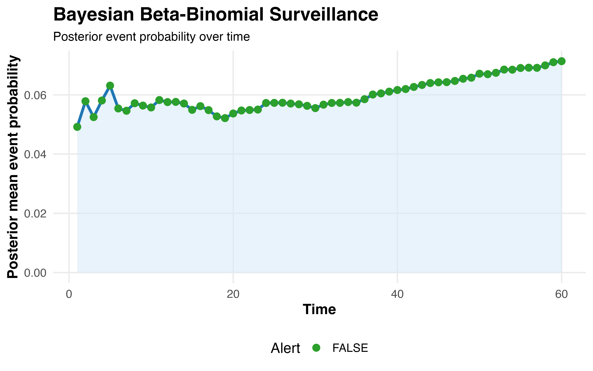
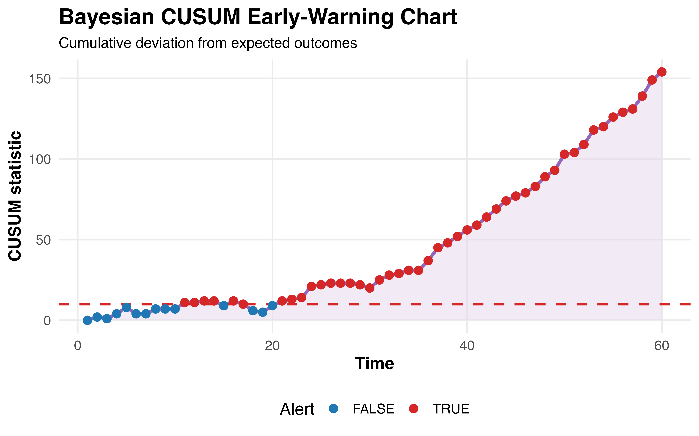
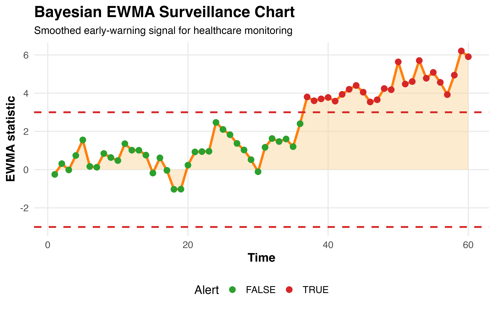

# BayesSurveillance

## Bayesian Surveillance Methods for Healthcare Performance Monitoring

**BayesSurveillance** is an R package that provides a comprehensive framework for Bayesian surveillance, prospective monitoring, and early warning detection in healthcare systems.

The package implements Bayesian statistical process control methods for monitoring healthcare quality, patient safety, provider performance, cancer pathways, clinical outcomes, and service delivery metrics. By incorporating Bayesian updating, posterior predictive inference, and sequential monitoring techniques, BayesSurveillance enables earlier detection of performance deterioration while appropriately quantifying uncertainty.

---

## Key Features

### Bayesian Monitoring

* Beta-Binomial monitoring for binary outcomes
* Poisson-Gamma monitoring for count outcomes
* Posterior predictive monitoring
* Bayesian alert probabilities
* Expected-versus-observed event monitoring

### Sequential Surveillance

* Bayesian CUSUM charts
* Bayesian EWMA charts
* Risk-adjusted CUSUM
* Risk-adjusted EWMA
* Early warning signal detection

### Risk Adjustment

* Risk-adjusted performance monitoring
* Provider-level benchmarking
* Healthcare quality surveillance
* Small-area variation monitoring

### Model Assessment

* Calibration assessment
* ROC analysis
* Discrimination evaluation
* Predictive performance assessment

### Visualisation

* Bayesian funnel plots
* Surveillance dashboards
* Research-quality figures
* Publication-ready graphics

---

## Methodological Contributions

BayesSurveillance extends traditional healthcare monitoring approaches by combining:

1. Bayesian updating of performance estimates.
2. Sequential surveillance using Bayesian control charts.
3. Risk-adjusted monitoring of healthcare outcomes.
4. Posterior predictive alerting systems.
5. Uncertainty quantification using posterior probabilities.
6. Early warning signal detection for emerging performance deterioration.

These methods are particularly useful in settings involving:

* Rare events
* Small sample sizes
* Sequential monitoring
* Healthcare quality improvement
* Patient safety surveillance
* Cancer pathway monitoring

---

## Installation

Install the development version directly from GitHub:

```r
install.packages("remotes")

remotes::install_github("zerish12/BayesSurveillance")
```

---

## Quick Start

```r
library(BayesSurveillance)

# Simulate surveillance data
dat <- simulate_surveillance_data()

# Beta-binomial monitoring
fit <- beta_binomial_monitor(
  events = dat$events,
  total = dat$total
)

summary(fit)

# Plot surveillance results
plot_surveillance(fit)
```

---

## Bayesian CUSUM Example

```r
cusum_fit <- bayesian_cusum(
  events = dat$events,
  total = dat$total
)

plot_surveillance(cusum_fit)
```

---

## Bayesian EWMA Example

```r
ewma_fit <- bayesian_ewma(
  events = dat$events,
  total = dat$total
)

plot_surveillance(ewma_fit)
```

---

# Example Figures

## Figure 1: Beta-Binomial Surveillance



---

## Figure 2: Bayesian CUSUM Monitoring



---

## Figure 3: Bayesian EWMA Monitoring



---

## Applications

BayesSurveillance can be applied to:

* Cancer pathway surveillance
* Hospital quality monitoring
* Surgical outcomes monitoring
* Patient safety monitoring
* Healthcare provider benchmarking
* Public health surveillance
* Early warning systems
* Healthcare performance assessment
* Quality improvement programmes

---

## Research Applications

Potential applications include:

* Bayesian healthcare surveillance
* Adaptive monitoring systems
* Statistical process control
* Clinical quality monitoring
* Cancer service evaluation
* Real-world evidence generation
* Healthcare performance benchmarking

---

## Citation

If you use BayesSurveillance in research, please cite:

```r
citation("BayesSurveillance")
```

---

## Author

**Muhammad Zahir Khan**

Independent Researcher

GitHub: https://github.com/zerish12

---

## License

GPL-3

---

## Development Status

BayesSurveillance is under active development.

Future releases will include:

* Adaptive Bayesian surveillance
* Dynamic intervention learning
* Bayesian decision-theoretic monitoring
* Sequential policy optimisation
* PEIB-based adaptive surveillance
